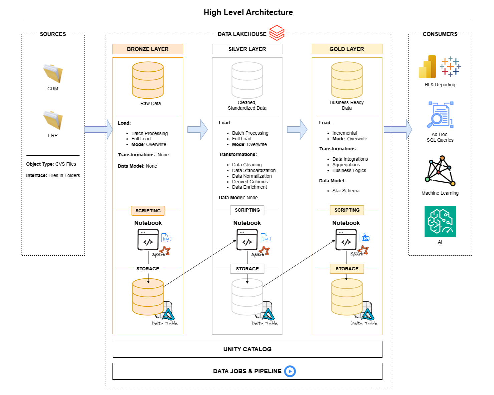
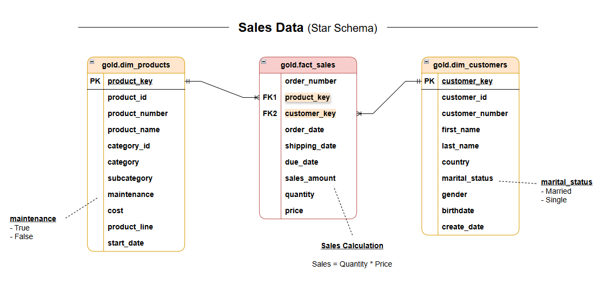

# Data Lakehouse and Analytics Project

**Welcome to the Data Lakehouse and Analytics Project repository! 🚀**

This project demonstrates an end-to-end Databricks Lakehouse architecture, where data from multiple sources is ingested and transformed using PySpark and organized into Bronze, Silver, and Gold layers following the Medallion Architecture.
The goal of this project is to build a scalable data pipeline that converts raw data into analytics-ready datasets for reporting and business insights.

---

## 🏗️ Data Architecture


## Medallion Architecture

This project follows the **Medallion Architecture**, which organizes data into three layers to progressively improve data quality and usability.

1. **Bronze Layer** – Stores raw ingested data from source systems with minimal or no transformations.
2. **Silver Layer** – Contains cleaned, standardized, and enriched data prepared for further analysis.
3. **Gold Layer** – Provides business-ready datasets and aggregated tables optimized for reporting and analytics.

This layered approach improves **data reliability, scalability, and maintainability** in modern lakehouse data platforms.

---
## 📖 Project Overview

This project involves:

- **Data Architecture:** Designing a modern Data Lakehouse using the Medallion Architecture with Bronze, Silver, and Gold layers.
- **Data Pipelines:** Ingesting and transforming data from source systems into Databricks Delta Tables using PySpark.
- **Data Workflow Orchestration:** Managing and scheduling data pipelines using Databricks Workflows to ensure automated and reliable data processing.
- **Data Transformation:** Cleaning, standardizing, and enriching data to create reliable intermediate datasets.
- **Analytics & Reporting:** Preparing business-ready data for analysis, reporting, and dashboarding.
 
   
4. **Analytics & Reporting**: Creating SQL-based reports and dashboards for actionable insights.

🎯 This repository is an excellent resource for professionals and students looking to showcase expertise in:
- SQL Development
- Data Architect
- Data Engineering  
- ETL Pipeline Developer  
- Data Modeling  
- Data Analytics  

---

## 🛠️ Important Links & Tools:

Everything is for Free!
- **[Datasets](datasets/):** Access to the project dataset (csv files).
- **[Databricks](https://www.databricks.com/):** Databricks is a unified data and AI platform that enables scalable data engineering, analytics, and machine learning on top of the Lakehouse architecture. 
- **[Git Repository](https://github.com/):** Set up a GitHub account and repository to manage, version, and collaborate on your code efficiently.
- **[DrawIO](https://www.drawio.com/):** Design data architecture, models, flows, and diagrams.

---

## Tech Stack

* **Databricks:** Data processing and lakehouse platform
* **PySpark:** Data transformation and pipeline development
* **Delta Lake:** Storage layer for reliable and scalable data management
* **Unity Catalog:** Centralized governance and access control for data assets
* **Spark SQL:** Data querying and analysis
* **Power BI:** Data visualization and reporting

---

## ▶️ Data Pipeline Workflow

1. **Data Ingestion** – Raw data from CRM and ERP systems is ingested into the Bronze layer.
2. **Bronze Layer** – Stores raw data in Delta tables with minimal transformations.
3. **Silver Layer** – Data is cleaned, standardized, and enriched using PySpark transformations.
4. **Gold Layer** – Business-ready datasets are created for analytics and reporting.
5. **Analytics** – Gold layer tables are used for dashboards, reporting, and business insights.

---

## 📂 Repository Structure
```
data-warehouse-project/
│
├── datasets/                           # Raw datasets used for the project (ERP and CRM data)
│
├── docs/                               # Project documentation and architecture details 
│   ├── lakehouse_architecture.drawio   # Draw.io file shows the project's architecture
│   ├── data_catalog.md                 # Catalog of datasets, including field descriptions and metadata
│   ├── data_integration.png            # Describes how tables are related
│   ├── data_lineage.drawio             # Draw.io file for the data flow diagram
│   ├── data_models.drawio              # Draw.io file for data models (star schema)
│   ├── naming-conventions.md           # Consistent naming guidelines for tables, columns, and files
│
├── scripts/                            # Databricks notebooks for data pipelines and transformations
│   ├── bronze/                         # Notebooks for ingesting and loading raw data
│   ├── silver/                         # Notebooks for cleaning and transforming data
│   ├── gold/                           # Notebooks for creating business-ready datasets
│   ├── init_lakehouse.ipynb            # Notebook for initializing and orchestrating the lakehouse pipeline
│
├── README.md                           # Project overview and instructions
├── LICENSE                             # License information for the repository

```
---

## 🛡️ License

This project is licensed under the [MIT License](LICENSE). You are free to use, modify, and share this project with proper attribution.

## 🌟 About Me

Hi there! I'm Kaustubh Sutar, a data enthusiast and aspiring Data Analyst skilled in **Power BI, SQL, Python, and Excel**. I enjoy building data pipelines, analyzing datasets, and creating dashboards that turn raw data into actionable insights. I'm also exploring **Machine Learning and AI** to expand my analytical capabilities.

Let's stay in touch! Feel free to connect with me on the following platforms:

[](https://www.linkedin.com/in/kaustubh-sutar-814134340/)

